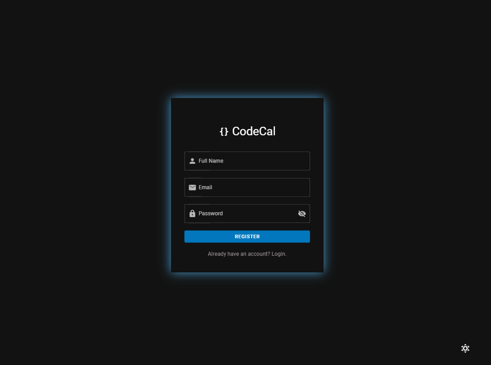
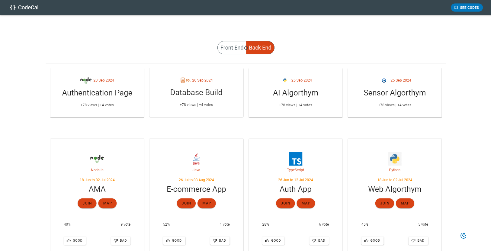
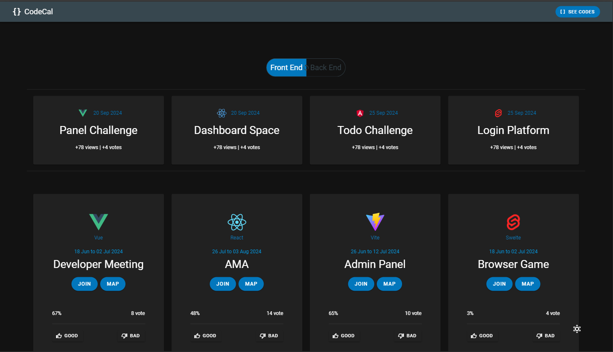
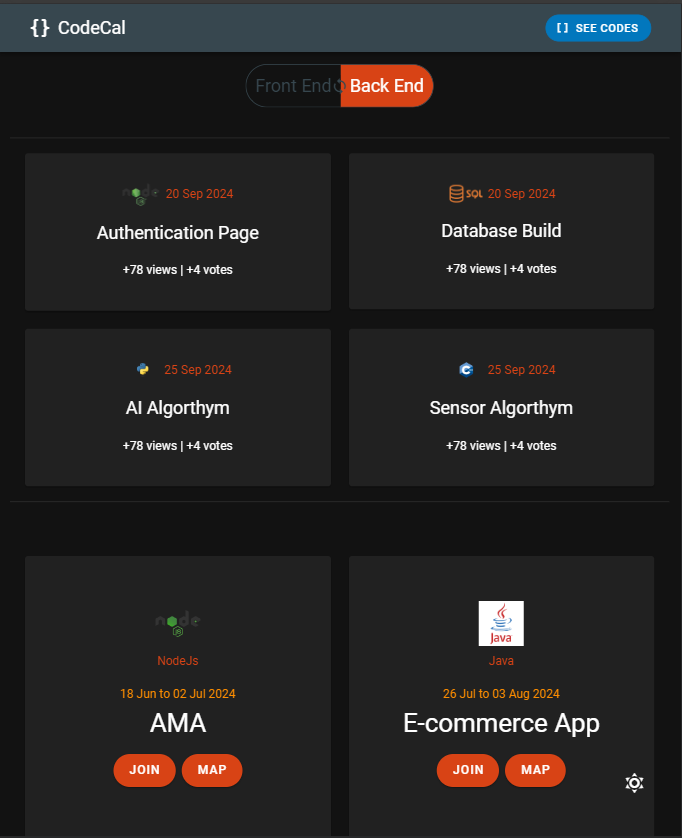
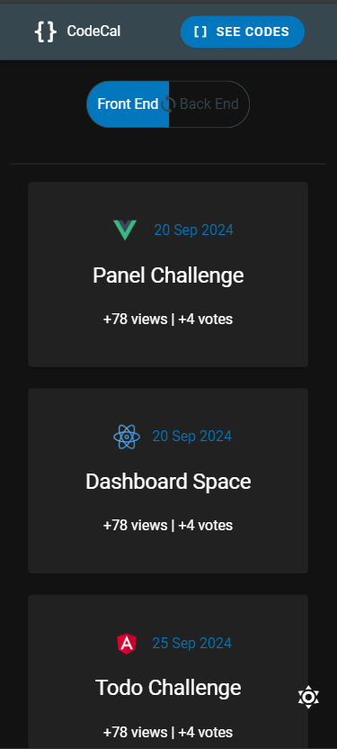

## CodeCal


## Technologies

- TypeScript
- Vue
- Vuetify
- Vite
- Vue Router
- Pinia
- Firebase
- Axios
- Rest API

## Light Mode


## Dark Mode


## Tablet View 


## Mobile View 


## Installation

To clone the repository, run the following command:

```sh
git clone https://github.com/gokhankatar/codecal-test-app

``` 
go to directory

```sh
cd .\codecal-test-app\

``` 
and then install npm:

```sh
npm install -f

``` 
open your browser:

```sh
npm run dev

